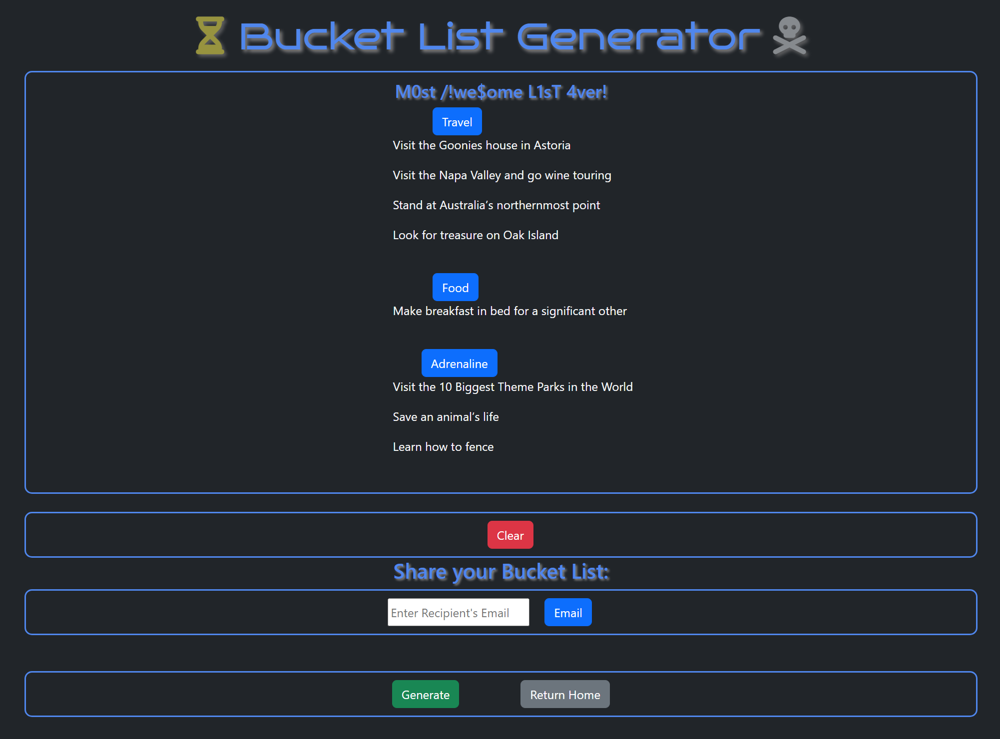

# bucketlist-generator
Bucket List Generator

## Description

This is a fully deployed website app the lets the user randomly generate ideas that suggest something to do before you die and allows the user to add them categorically to their user list.  Additional functionality includes sharing the app with others and more to come!

## Usage
Usable on any web browser and even on mobile, the UI is intuitive with basic button functions.  Upon landing the user is presented with exmaple lists from other users.  Scrolling down to the bottom allows the user to login.  Once logged in generating a new idea and adding it to the list should be a breeze! 

## Credit

Lukas Durkin, David Clarke, Andrew Dean & the great help I got from Leif and Fred!!

## Github
https://github.com/DukeLurkin/bucketlist-generator

## Heroku

https://shielded-thicket-91990.herokuapp.com/